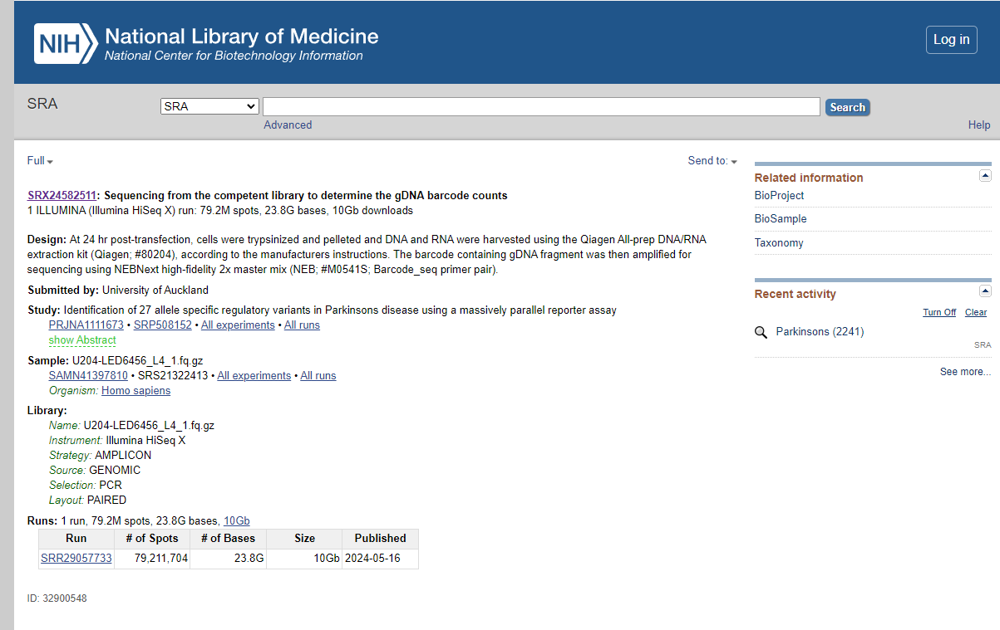
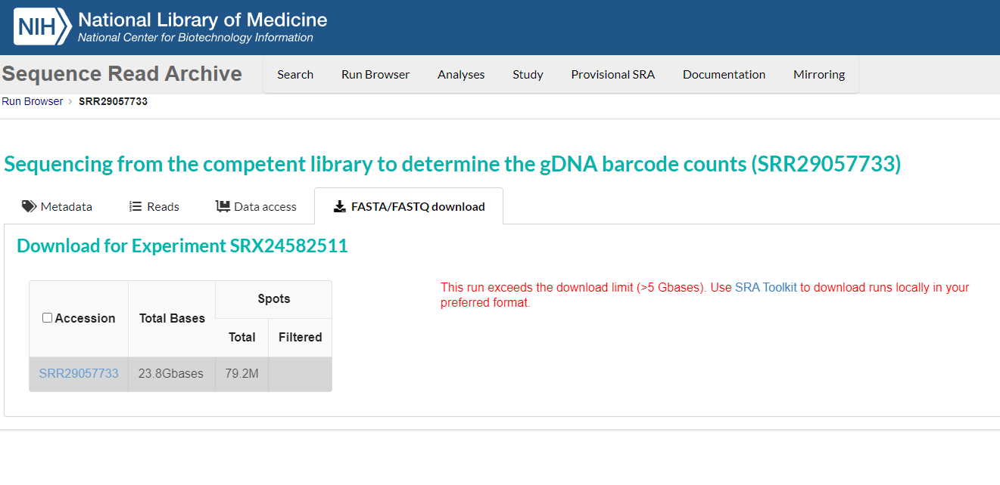

# Sample Set Creation by Gathering Data

Objective: Learn how to gather data from the NCBI database to create a sample set of genomes for a specific research topic.

Bioinformatics research is about establishing patterns in genetic material that can then be used to make predictions about the behavior of other genomes. Traditionally, this is done by creating a model that uses features of the genomes to make a prediction. The features are often derived from the genetic material itself, such as k-mers, or from other sources, such as gene expression data. Since these patterns can be so small, it is often difficult to find them using human analysis, so we use bioinformatics tools to help us find them.

One of these tools is the representative genome set that you created in the first unit. A second one can be the hammer set that you created in the second unit. Another can be the bv-brc.org and the multitude of tools available in the sratoolkit you have also installed throughout this course.We are now going to use these tools to create an even more powerful tool: a machine learning model that we can use to either diagnose a disease or create a treatment to target the disease. To do this, we need to gather data from the NCBI database that is relevant to the research topic we are interested in.

## Materials
[Grimoire](https://chat.openai.com/g/g-n7Rs0IK86-grimoire)
[NCBI](https://www.ncbi.nlm.nih.gov/)
[SRAToolkit Download FASTA Documentation](https://www.ncbi.nlm.nih.gov/books/NBK242621/)

FIG-Bioinformatics-Course/
├── 3_Projections
    └── 3.1_Sample-Set-Creation/
        └── Sample-Set-Creation Exercise-1_Gather_Data.md (you are here)

## Exercise

1. Ask Grimoire to describe the different types of machine learning models that can be used to predict the presence of a disease. Specifically mention classification, random forest, and sample set creation.

2. The machine learning model that we are going to create is a classification model. This model basically takes a set of samples that have been categorized into diseased or healthy and uses that as a key to determine what the pattern for each group is. Then is uses the genomes found within a mystery sample to make a prediction about the health status of the sample. Kind of like we were doing in a smaller scale in the previous units, we will be doing it on a larger scale and with a lot more data. This increases the accuracy of the model and allows us to make more accurate predictions. Below are a list of research topics that can be applicable to our objective of classification. Choose one of the topics below. If you would like to choose a different topic, do a little research first to ensure that the gut microbiome has been studied for that specific topic. Otherwise it is possible that your machine learning model will not be able to distinguish between the two groups and will not be able to make accurate predictions.

   1. **Obesity**
   2. **Type 2 Diabetes**
   3. **Inflammatory Bowel Disease (IBD)**
   4. **Mental Health**
   5. **Dietary Allergies**
   6. **Autoimmune Diseases**
   7. **Alzheimer's Disease**
   8. **Parkinson's Disease**

3. Now that we have chosen a research topic, we need to gather data from the NCBI database. Please go to https://www.ncbi.nlm.nih.gov/ and search for the topic you chose. This will give you a few different things that are relevant to our objective. 


Firstly, we have the Literature section. This section will give you research papers and articles that are relevant to your topic. It can give you a good idea of what is currently known about the topic and can help you understand the current state of research. It can also lead us to where data is available within the Data sections of each academic paper published on the topic. If you want to find data this way, click on "PubMed" and a search with all of the papers relevant to your topic will be published. Make sure you pay attention to the data availability section of each paper as well as the authors. Often times an author will use the same data set for multiple publications and if they do you might end up with duplicate data if you use both of their papers.

Secondly we have the Genomes section. This section will give you any and all genomes that have been tagged with your specific topic. Depending on your need, you can choose to look at the BioProject which has all the samples from a multiple research project, or a BioSample which contains individual samples from one experiment, or the SRA which contains all of the raw data from a single sample. Ask Grimoire to describe any other sections of this page that you find interesting.

Click on the SRA heading to see all the data we are looking for.


4. Inside of this search, you will see a list of different SRA samples that are relevant to your topic. Each one has a link, a description of metadata, and an Accession number underneath it. Ask Grimoire to describe what "spots" and "bases" are referring to in terms of a metagenome sample. 

5. Good Data is important. It keeps our classifier accurate and our predictions useful. However, having an overwhelming abundance of data is the only way to ensure that our model can identify enough of a pattern to make an accurate prediction. In this way, we need to find a balance between the number of samples that we use and the quality of the data that we gather. If you click on any of the links inside of your search, you will find a page with all the metadata associated with that sample. 



6. Another thing we need to keep in mind is the variables that we create by choosing our data. For example, if we were trying to classify apples as bruised or not bruised, and then never included a green apple, it is possible that our model would not be able to classify the green apple correctly because it does not have any data on green apples. In the same vein, we also need to make sure that we include a diverse set of samples. However too much diversity can be problematic as well. If we included every type of apple as well as every type of banana, it is possible that it would classify all bananas as apples and give us a very inaccurate prediction. Therefore we need to be sure that we keep some variables constant so that we can make accurate predictions. 
For this purpose, we will keep many of the metadata variables constant. If all of our samples are processed the same way, then we filter out all of the "banana" samples and keep our classification to only the apples and not confuse our model. So when choosing your data, notice whether it is from the gut microbiome, saliva, blood, or other types of samples. These are all different sources of data and can effect how our model performs. Notice that the Library section of the metadata includes Strategy, Source, Selection, and Layout. We want these variables to also be constant across our samples with Strategy and Layout being the most important. Ask Grimoire to describe what Amplicon vs Whole Genome Shotgun Sequencing is and the differences between the two.

7. Notice also that each of the SRAs have a Run associated with it. That Run is the metagenomic sample that we are interested in. Click on the Run to see the Sequence Read Archive and the information associated with the run. It will have a tab inside that page that says "FASTA/FASTQ Download". This is a webpage that will allow you to download a FASTA file that you can then use with your hammer set and representative genome set. It is also the same data you would get through a p3-download command in the command line.


8. Sometimes the FASTQ file is too big to download from the webpage. In that case, you can use the command line to download the data using the SRA run accession number. If you have not already installed the SRA toolkit, now would be a good time to do so. Once you have installed the SRA toolkit, you can use the following command to download the data **Be sure to replace the SRR12345678 with your SRA run accession number**:

```
prefetch SRR12345678
```



9. After you have downloaded a single SRA run, you can use the following command to convert the data into a FASTA file **Again, be sure to replace the SRR12345678 with your SRA run accession number**:

```
fastq-dump --split-files SRR12345678
```

10. Follow these steps to download and convert your data for the rest of the samples in your search. Note that this process can take a very long time depending on how many samples you have. But the more samples you have, the more accurate your model will be. For now, download and convert 10 samples so that you have enough data to test your programs. Once you are done, make sure that all of your samples are included in the Data directory of this course to make them easier to access later.